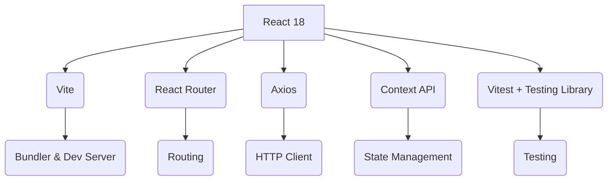

<div align="center">
  
# 📖 Exquis - Collaborative Storytelling Game

## **Frontend Repository**
  


Create unexpected and entertaining stories, one collaboration at a time.
  
</div>

---

**See the backend repository at:** [https://github.com/LinCarbajales/project-exquis-literary-app-back](https://github.com/LinCarbajales/project-exquis-literary-app-back)

---

## 🎭 What is Exquis?

**Exquis** is a collaborative storytelling game inspired by the Surrealist **"Cadavre Exquis"** technique, where each user continues a story knowing only the last contribution.

This repository contains the **frontend** of the application — a **React + Vite** client that connects to the Java Spring Boot backend.

---

## ✨ Features

### 🧩 Interactive Gameplay
Fetches stories and collaborations from the backend API using **Axios**.
Allows users to:
* **Register, log in, and view their profile.**
* **Receive a random story assignment.**
* **Read only the last collaboration.**
* **Submit their continuation** within character limits.
* **Explore completed stories** once published.

### 🎨 UI/UX
* Clean, minimalist design inspired by literary themes.
* Responsive layout with **React Router** navigation.
* Dynamic visual feedback (loading states, errors, and completion).
* Color palette emphasizing creativity and readability.

### ⚙️ State & Context
* **React Context API** for global authentication and session state.
* Persistent login across sessions.
* Centralized **API service** for backend communication.

### 🧪 Testing
* Comprehensive test suite using **Vitest** and **React Testing Library**.
* Unit and integration tests for components and routing.
* Mock API responses for isolated testing.

---

## 🏗️ Architecture

### Frontend Stack



### Project Structure

```
src/
├── assets/                   # Static images, icons, and styles
├── components/               # Reusable UI components
│   ├── Button.jsx            # Custom styled button
│   ├── Header.jsx            # Navigation bar with session logic
│   └── ...
├── context/                  # Global state management
│   ├── AuthContext.jsx       # Provides authentication context
│   └── ...
├── pages/                    # Application pages
│   ├── Login.jsx             # User login
│   ├── Register.jsx          # User registration
│   ├── CollaboratePage.jsx   # Story assignment and submission
│   ├── Collaboration.jsx     # Individual collaboration view
│   ├── CompletedStories.jsx  # View of completed stories
│   └── ...
├── services/                 # API communication layer
│   ├── api.js                # Axios configuration & endpoints
│   └── ...
├── tests/                    # Unit & integration tests
│   ├── Header.test.jsx
│   ├── Login.test.jsx
│   └── ...
├── App.jsx                   # Root component with routing
├── main.jsx                  # Entry point
└── index.css                 # Global styles
```

---

## 🎨 Color Palette

| Element | Color (Hex) | Description |
| :--- | :--- | :--- |
| **Background** | `#F5F5F5` | Soft neutral canvas |
| **Primary Text** | `#222222` | High readability |
| **Accent** | `#A259FF` | Highlighted buttons/links |
| **Secondary Accent** | `#FFB703` | Interactive hover elements |
| **Error/Alert** | `#E63946` | Validation or warning color |

---

## 🚀 Installation

### Quick Start

```bash
# Clone the repository
git clone https://github.com/LinCarbajales/project-exquis-literary-app-front.git
cd project-exquis-literary-app-front

# Install dependencies
npm install

# Run the development server
npm run dev

# Open in browser
# http://localhost:5173
```

---

## 🧪 Testing
The project includes tests for components and authentication logic.

```bash
# Run all tests
npm test
```

Example test files:
* `Header.test.jsx`
* `Login.test.jsx`

---

## 🌐 API Integration
The frontend communicates with the backend’s **REST API endpoints** via **Axios**, using consistent request structures for:

* **Authentication** (`/api/login`, `/api/users/register`)
* **Story management** (`/api/stories/assign`, `/api/stories/completed`)
* **Collaboration submission** (`/api/collaborations`)

All backend logic and endpoints are detailed in the [Exquis Backend Repository](https://github.com/LinCarbajales/project-exquis-literary-app-back).

---

## 🗺️ Roadmap
### Planned Enhancements
* User profile customization (avatar, bio)
* Improved mobile layout
* Light/Dark mode toggle
* Social features (follow users, comments)
* Internationalization (i18n)

---

## 👥 Authors
* **Lin Carbajales** – [GitHub](https://github.com/LinCarbajales)

---

## 🙏 Acknowledgments
* Inspired by the Surrealist movement’s "Cadavre Exquis" technique
- Built with Spring Boot and modern Java practices

</div>
